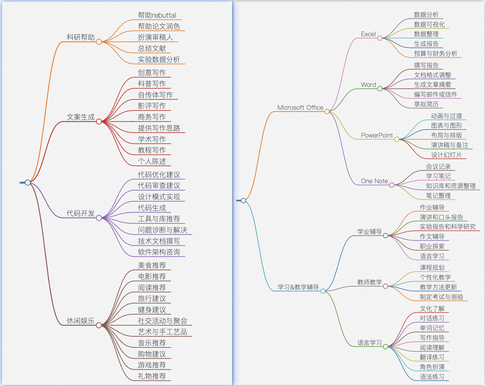

<h1 align="center">
💡Prompt Genius
</h1>
<p align="center">
    <a href="./readme-en.md">English</a> | 中文
</p>
<p align="center">
    <em>全面、有效的 ChatGPT指令大全</em>
</p>

## Why use Prompt Genius?

- 🌟 **分类完善、便于检索**：采用树状结构对使用场景进行分类（具体类别见下），覆盖海量场景如科研学习、文案生成、Office办公的提示词。
- 🚀 **热门提示词**：持续收集和展示热门提示词，帮助获得用户期望的、高质量回复，从而提升生产力。
- 🌎 **多语言支持**：目前支持中文、英文、日语、韩语和德语等多种语言。
- 🛠 **便捷操作**：支持提示词复制功能
- 🆕 **定期更新**：提示词来自网络精选和 Awesome ChatGPT Prompts和用户投稿，定期进行更新。
- 📦 **开箱即用**：[www.promptgenius.site](https://www.promptgenius.site)


## 使用说明

Prompt Genius 页面默认显示热门分类提示词，页面分为分类检索区、搜索区和提示词展示区。


### 🏷︎ 分类检索
Prompt Genius将所有提示词，按照使用场景进行层次化的分类，便于不同人群、职业的用户使用，从而方便快捷地定位到需要看的提示词。
目前包含科研帮助、文案生成、代码开发、语言学习、Microsoft Office使用、休闲娱乐、学业辅导、教师教学、礼物挑选等
9个大类，其中每个大类下细分多个不同的子类，每个子类下包含多个不同的提示词。 目前整体分类体系如下：





### 🔍 关键词搜索

关键词搜索范围包括提示词类别标签和内容。输入关键词后，按回车键，提示词展示区将展示查找出的内容。


### 🔬 展示区

通过关键词搜索，点击卡片左上方的「copy」按钮即可复制提示词，将其粘贴到 ChatGPT 中。展示信息包括提示词类别标签、author信息（带有或者不带有链接。）


### 🌎 语言切换

网站默认使用英文，因为ChatGPT等在英文上的训练语料更多，更加容易获得高质量的结果。如果需要使用中文或者其他语言，如日语、韩语、德语等，可以在页面右上角进行语言切换。
切换之后将显示当前类别下，新语言的提示词。


### 用户投稿
如果您正好知道一个实用的提示词但本网站并未列出，您可以在此提交。感谢您的贡献！


## Technical Design

The frontend is build with [MDUI](https://www.mdui.org/) and [jQuery](https://jquery.com/).

The backend is implemented with [Flask](https://flask.palletsprojects.com/) plus other Python packages (please refer to [requirements](./requirements.txt)).

Huge shout-out to those excellent works. This project would be impossible without them.

### Start the server

```shell
# Install packages
pip install -r requirements.txt

# Start the Flask server in debug mode.
export FLASK_APP=app
export FLASK_DEBUG=true
flask run --port 9000

# Start the server with waitress for better performance in production environment.
waitress-serve --port=8080 --call app:create_app
```

<<<<<<< HEAD
## ChatGPT自己写

I want you to become my Expert Prompt Creator. Your goal is to help me craft the best possible prompt for my needs. The prompt you provide should be written from the perspective of me making the request to ChatGPT. Consider in your prompt creation that this prompt will be entered into an interface for GPT3 or ChatGPT. The process is as follows:

1. You will generate the following sections:
2. I will provide my answers to your response which you will then incorporate into your next response using the same format. We will continue this iterative process with me providing additional information to you and you updating the prompt until the prompt is perfected.
   Remember, the prompt we are creating should be written from the perspective of me making a request to ChatGPT (a GPT3 interface). Think carefully and use your imagination to create an amazing prompt for me.
   Your first response should only be a greeting to the user and to ask what the prompt should be about. All output shall be in Chinese.

=======
### Data model and database

Most data of this project, including some element contents, languages, class trees, and prompts are stored in a database.

The data model is defined in [the model file](./app/models.py) based on SqlAlchemy.
Technically, the abstracted model design makes it possible to freely choose various database solutions.

The database server to connect is claimed in [the configuration file](./app/app_config.json). We give an example of using SQLite as the database. It is fully file-based and good for lightwight application like this. If no existing database are given, SqlAlchemy will create a new database file (located in `./instance` directory) with empty tables. You can then add your own data accordingly.
>>>>>>> cb69e9412c6446eb77cc90bae4edea83f697c993
